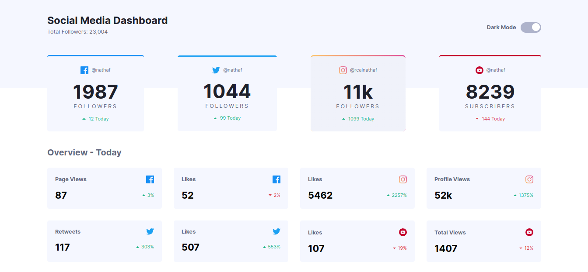
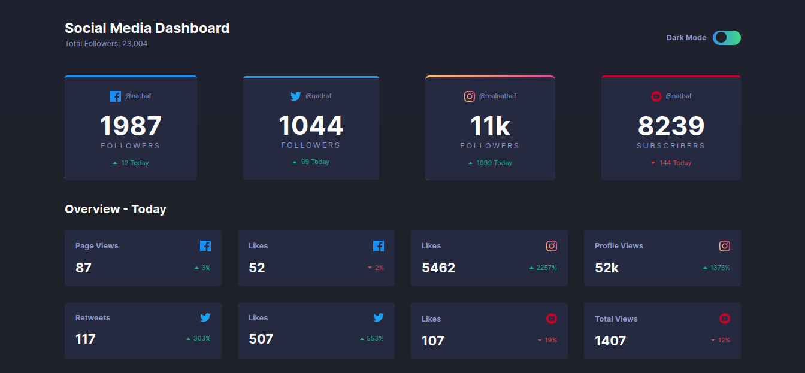

# Frontend Mentor - Social media dashboard with theme switcher solution

This repository is about the solution challenge: [Social media dashboard with theme switcher](https://www.frontendmentor.io/challenges/social-media-dashboard-with-theme-switcher-6oY8ozp_H).

[Version this documentation in portugues]()

## Table of contents

- [Overview](#overview)
  - [The Challenge](#the-challenge)
  - [Screenshot](#screenshot)
  - [Links](#links)
- [Development process](#development-process)
  - [Technologies used](#technologies-used)
- [Author](#author)

## Overview

### The Challenge

This challenge is about creating a dashboard-style application, informing the data of views, access to post and likes and among other filters, among the main social networks: Facebook, Instagram, Twitter and YouTube.

The values passed from this data are static values, and the application also has the option to change the theme.

### Screenshot

### Links

- Challenge solution: [Add solution URL here](https://your-solution-url.com)
- Online application: [Social Media Dashboard](https://socialmediadashboardwiththem.challenges-frontendmentor-junior.pages.dev/)

## Development process

### Technologies used

- HTML5 semantic
- CSS
- Flexbox
- CSS Grid
- Mobile-first
- JavaScript

## Author

- LinkedIn - [www.linkedin.com/in/lucas-anselmo-moraes-da-silva](https://www.linkedin.com/in/lucas-anselmo-moraes-da-silva-543636161/)
- GitHub - [github.com/LucasAnselmoSilva12345](https://github.com/LucasAnselmoSilva12345)
- DevTo - [@lucas_anselmo](https://dev.to/lucas_anselmo)
- Frontend Mentor - [@yourusername](https://www.frontendmentor.io/profile/yourusername)
- Twitter - [@LucasAnselmo202](https://twitter.com/LucasAnselmo202)
